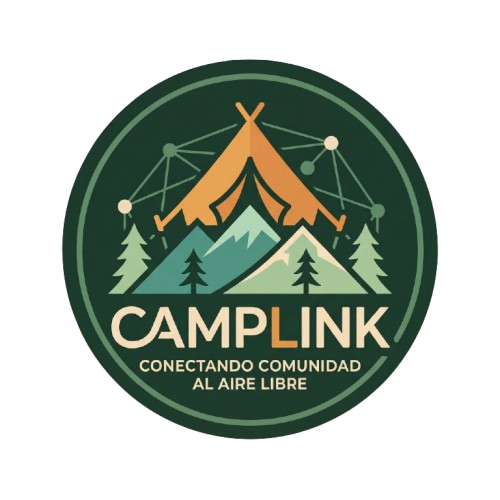

# 🚐 Camplink | Plataforma Integral Camper & Autocaravanista

<div align="center">



**Conectando a la comunidad nómada, simplificando la pernocta libre y optimizando cada kilómetro de ruta.**

[](https://www.djangoproject.com/)
[](https://react.dev/)
[](https://vitejs.dev/)
[](https://sass-lang.com/)
[](https://www.postgresql.org/)
[](https://web.dev/progressive-web-apps/)

</div>

---

## 📖 Índice

1. [Descripción General](#-descripción-general)
2. [Características Principales](#-características-principales)
3. [Arquitectura y Stack Tecnológico](#-arquitectura-y-stack-tecnológico)
4. [Requisitos Previos](#-requisitos-previos)
5. [Instalación y Configuración Local](#-instalación-y-configuración-local)
   - [5.1. Clonar el Repositorio](#51-clonar-el-repositorio)
   - [5.2. Configuración del Backend (Django)](#52-configuración-del-backend-django)
   - [5.3. Configuración del Frontend (React + Vite + Sass)](#53-configuración-del-frontend-react--vite--sass)
   - [5.4. Variables de Entorno (`.env`)](#54-variables-de-entorno-env)
6. [Despliegue con Docker](#-despliegue-con-docker)
7. [Guía de Uso de la Plataforma](#-guía-de-uso-de-la-plataforma)
8. [Notificaciones Web Push y PWA](#-notificaciones-web-push-y-pwa)
9. [Comandos Útiles y Testing](#-comandos-útiles-y-testing)
10. [Estructura del Proyecto](#-estructura-del-proyecto)
11. [Licencia y Créditos](#-licencia-y-créditos)

---

## 🌟 Descripción General

**Camplink** es una plataforma web progresiva (PWA) y red social vertical diseñada para resolver la fragmentación de información que sufren furgoneteros y autocaravanistas en España y Europa. 

Unifica en un único ecosistema la búsqueda de pernoctas verificadas, cálculo predictivo de combustible y autonomía vial, conexión en vivo con precios de gasolineras del Ministerio (MITECO), un diario de ruta comunitario, un taller colaborativo con modelos 3D descargables, planificación colaborativa de viajes en tiempo real y un sistema de gamificación con más de 65 trofeos.

---

## ✨ Características Principales

* 🗺️ **Cartografía Inteligente Multicapa:**
  - 6 tipologías normalizadas: Pernocta Libre, Áreas de Autocaravanas, Campings, Parkings Urbanos, Áreas Recreativas y Puntos Solo Servicios.
  - 5 capas temáticas: OpenStreetMap, Relieve Topográfico, Satélite HD, Precipitaciones en Vivo (OpenWeatherMap) y Contaminación Lumínica (DarkSky).
  - Filtros avanzados por gálibo/altura, servicios (agua potable, vaciado de aguas negras/grises, electricidad, duchas, WiFi, mascotas permitidas).

* 📡 **Radar Nómada en Vivo:**
  - Consulta geoespacial en tiempo real conectada a la API de hidrocarburos de MITECO.
  - Localiza las gasolineras más económicas en radios de 5 a 50 km ordenadas por precio y distancia.
  - Enlaces profundos de navegación inmediata hacia servicios esenciales (supermercados, talleres, lavanderías, fuentes).

* ⛽ **Algoritmo de Autonomía Vial:**
  - Cálculo de kilometraje acumulado en itinerarios con paradas múltiples.
  - Alerta predictiva al superar el 80% de la capacidad del depósito con reseteo inteligente en paradas de repostaje.

* 📖 **Diario de Ruta Comunitario:**
  - Red social nómada con compresión de imágenes en el cliente (reducción del 95% del peso antes de la subida).
  - Reacciones temáticas (`Fuego 🔥`, `Pino 🌲`, `Alerta ⚠️`), comentarios anidados y menciones de usuarios.

* 🛠️ **Taller Camplink & Repositorio 3D:**
  - Foro de bricos, guías de camperización y resolución técnica de averías.
  - Repositorio comunitario de piezas descargables en formatos `.stl` y `.3mf`.
  - Moderación previa de publicaciones y soporte para formato enriquecido Markdown.

* 🤝 **Organizador de Viajes Compartidos:**
  - Planificación colaborativa de itinerarios en tiempo real entre compañeros de ruta.
  - Sincronización instantánea de paradas, lugares y notas compartidas.

* 🏆 **Gamificación y Vitrina de Trofeos:**
  - Más de 65 hitos desbloqueables clasificados en rangos (Madera, Bronce, Plata, Oro y Platino).

* 📲 **PWA & Notificaciones Web Push (VAPID):**
  - Instalación como aplicación nativa en iOS, Android y Escritorio.
  - Notificaciones push en segundo plano con control granular de preferencias por correo y móvil.

---

## 🏗️ Arquitectura y Stack Tecnológico

El proyecto está diseñado bajo una arquitectura desacoplada cliente-servidor:

```
┌─────────────────────────────────────────────────────────────────────────────┐
│                           CAPA CLIENTE (FRONTEND)                           │
│   React 18 + Vite 5 + Sass (SCSS Modular) + Leaflet Maps + PWA ServiceWorker│
└───────────────────────────────────────┬─────────────────────────────────────┘
                                        │ JSON / HTTPS / WebSockets
┌───────────────────────────────────────▼─────────────────────────────────────┐
│                           CAPA SERVIDOR (BACKEND)                           │
│   Django 5.1 + Django REST Framework + PyWebPush VAPID + Brevo / SMTP API   │
└───────────────────────────────────────┬─────────────────────────────────────┘
                                        │ SQL Queries
┌───────────────────────────────────────▼─────────────────────────────────────┐
│                            BASE DE DATOS & MEDIA                            │
│   PostgreSQL 16 (Producción) / SQLite (Desarrollo) + Almacenamiento Media   │
└─────────────────────────────────────────────────────────────────────────────┘
```

### Tecnologías Utilizadas

| Componente | Tecnología | Versión | Propósito |
| :--- | :--- | :--- | :--- |
| **Frontend Framework** | React | `^18.2.0` | Interfaz reactiva SPA y Single-Page Navigation |
| **Empaquetador** | Vite | `^5.4.0` | HMR ultrarrápido y optimización de bundles |
| **Estilos** | Sass (SCSS) | `^1.97.2` | Arquitectura modular `@use`, tokens y Glassmorphism |
| **Mapas** | Leaflet / React-Leaflet | `^1.9.4` / `^4.2.1` | Renderizado interactivo de capas y clusters |
| **Backend Framework** | Django | `5.1.15` | ORM, lógica de negocio y seguridad |
| **API REST** | Django REST Framework | `3.15.2` | Endpoints serializados y autenticación híbrida |
| **Web Push** | pywebpush + cryptography | `2.0.3` | Notificaciones push estándar VAPID (RFC 8292) |
| **Base de Datos** | PostgreSQL / SQLite3 | `16` | Persistencia relacional de spots, rutas y usuarios |
| **Contenedores** | Docker & Docker Compose | `3.8` | Despliegue reproducible e infraestructura |

---

## 📋 Requisitos Previos

Asegúrate de tener instalados en tu sistema:

* **Node.js:** Versión `18.x` o superior (`node -v`).
* **npm:** Versión `9.x` o superior (`npm -v`).
* **Python:** Versión `3.10` o superior (`python3 --version`).
* **Git:** Para control de versiones (`git --version`).
* *(Opcional para producción)* **Docker y Docker Compose**.

---

## 🚀 Instalación y Configuración Local

### 5.1. Clonar el Repositorio

```bash
git clone https://github.com/tu-usuario/camplink.git
cd camplink
```

---

### 5.2. Configuración del Backend (Django)

1. **Acceder a la carpeta del backend y crear el entorno virtual:**
   ```bash
   cd backend
   python3 -m venv venv
   ```

2. **Activar el entorno virtual:**
   * En Linux / macOS / WSL:
     ```bash
     source venv/bin/activate
     ```
   * En Windows (PowerShell):
     ```powershell
     .\venv\Scripts\Activate.ps1
     ```

3. **Instalar dependencias:**
   ```bash
   pip install --upgrade pip
   pip install -r requirements.txt
   ```

4. **Aplicar migraciones de la base de datos:**
   ```bash
   python manage.py migrate
   ```

5. **Crear superusuario administrador:**
   ```bash
   python manage.py createsuperuser
   ```

6. **Iniciar el servidor de desarrollo Django:**
   ```bash
   python manage.py runserver 0.0.0.0:8000
   ```

El backend estará disponible en `http://localhost:8000/`.

---

### 5.3. Configuración del Frontend (React + Vite + Sass)

1. **Abrir una nueva terminal y acceder a la carpeta frontend:**
   ```bash
   cd frontend
   ```

2. **Instalar dependencias de Node.js:**
   ```bash
   npm install --legacy-peer-deps
   ```

3. **Iniciar el servidor de desarrollo Vite:**
   ```bash
   npm run dev -- --host 0.0.0.0
   ```

El frontend estará disponible en `http://localhost:5173/`.

---

### 5.4. Variables de Entorno (`.env`)

Crea un archivo `.env` en la raíz del proyecto (o utiliza la plantilla base):

```env
# ==============================================================================
# CONFIGURACIÓN GENERAL DJANGO
# ==============================================================================
DJANGO_SECRET_KEY=tu-clave-secreta-segura-django-2026
DJANGO_DEBUG=True

# ==============================================================================
# BASE DE DATOS (OPCIONAL: Si no se define, se usará SQLite local)
# ==============================================================================
# POSTGRES_DB=camplink_db
# POSTGRES_USER=camplink_user
# POSTGRES_PASSWORD=tu_password_postgres
# POSTGRES_HOST=localhost
# POSTGRES_PORT=5432

# ==============================================================================
# SERVICIO DE CORREOS TRANSACCIONALES (SMTP / BREVO)
# ==============================================================================
EMAIL_HOST=smtp-relay.brevo.com
EMAIL_PORT=587
EMAIL_USE_TLS=True
EMAIL_HOST_USER=tu-usuario-smtp@camplink.com
EMAIL_HOST_PASSWORD=tu-contraseña-smtp
DEFAULT_FROM_EMAIL=Camplink <notificaciones@camplinkapp.com>
BREVO_API_KEY=tu-api-key-brevo-opcional

# ==============================================================================
# NOTIFICACIONES WEB PUSH (VAPID KEYS)
# ==============================================================================
VAPID_PUBLIC_KEY=tu_clave_publica_vapid_p256_base64url
VAPID_PRIVATE_KEY=tu_clave_privada_vapid_p256_base64url
VAPID_ADMIN_EMAIL=mailto:admin@camplinkapp.com
```

---

## 🐳 Despliegue con Docker

Para levantar la infraestructura completa (PostgreSQL + Backend Django + Frontend Nginx) en un solo comando:

```bash
# Construir y levantar todos los contenedores en segundo plano
docker compose up --build -d

# Ejecutar migraciones en el contenedor de Django
docker compose exec backend python manage.py migrate

# Crear superusuario dentro del contenedor
docker compose exec backend python manage.py createsuperuser
```

* **Frontend:** `http://localhost/` (Puerto 80/443)
* **API Backend:** `http://localhost/api/`
* **Panel de Administración:** `http://localhost/panel-camplink-gestion/`

---

## 📱 Guía de Uso de la Plataforma

| Sección | Ruta SPA | Funcionalidad Clave |
| :--- | :--- | :--- |
| **Inicio / Dashboard** | `/` | Resumen de pernoctas, acceso directo al radar y accesos rápidos. |
| **Mapa Descubre** | `/mapa` | Exploración de spots, filtros por servicios, cálculo de rutas y clima en vivo. |
| **Catálogo de Lugares** | `/lugares` | Vista en lista ordenada por valoración, cercanía y tipología. |
| **Diario de Ruta** | `/diario` | Feed social, publicación de vivencias con fotos comprimidas y comentarios. |
| **Taller Camplink** | `/taller` | Guías de brico, modelos de impresión 3D (.stl) y resolución de averías. |
| **Organizar Viajes** | `/organizar` | Planificador de ruta, cálculo de combustible y viajes compartidos. |
| **Vitrina de Trofeos** | `/trofeos` | Logros desbloqueados y medallas obtenidas. |
| **Mi Perfil** | `/perfil` | Gestión de vehículos, preferencias de notificaciones y seguridad. |

---

## 🔔 Notificaciones Web Push y PWA

1. **Instalación como App:**
   * En **Android / Chrome:** Aparecerá automáticamente el banner inferior *"Instala Camplink"*.
   * En **iOS / Safari:** Pulsa el botón *Compartir* (`⎋`) y selecciona *"Añadir a pantalla de inicio"*.
2. **Activación de Avisos:**
   * Una vez abierta la aplicación instalada, se mostrará el aviso para activar notificaciones Push.
   * En el menú de **Perfil $\rightarrow$ Preferencias de Notificaciones**, cada explorador puede personalizar de forma granular qué eventos recibir por Correo y cuáles por Notificación Push móvil (comentarios, reacciones, aprobaciones del taller y nuevos seguidores).

---


## 📄 Licencia y Créditos

Todos los derechos reservados.

* **Desarrollo & Arquitectura:** Eleazar Hernández

---

<div align="center">
  <sub>Hecho con pasión por y para la comunidad camper 🚐✨</sub>
</div>
